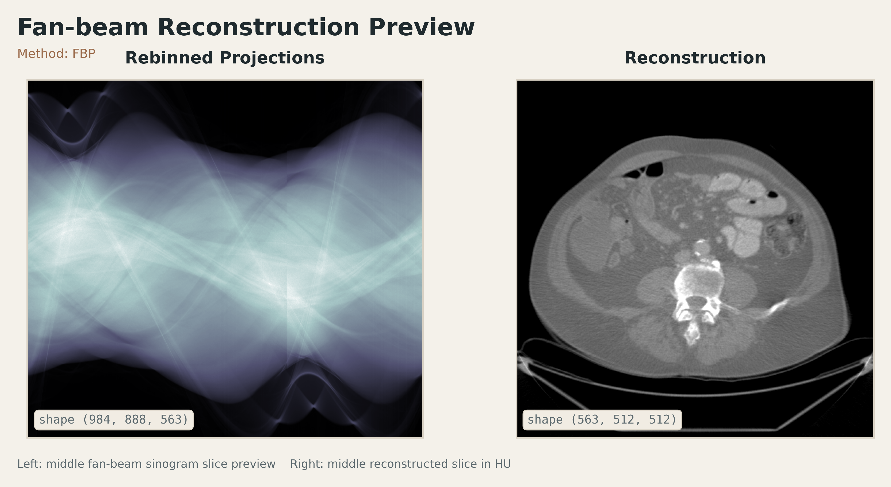

# 🌪️ Helix2Fan+

> **Fast & Enhanced** helical cone-beam to flat-detector fan-beam rebinning for `DICOM-CT-PD` raw projections

[中文说明](README_ZH.md)

A CT geometry-processing project for raw projection data in the [DICOM-CT-PD](https://doi.org/10.1118/1.4935406) format. `Helix2Fan+` rebins **helical cone-beam projections** into **flat-detector 2D fan-beam projections**, and then reconstructs them slice by slice with fan-beam FBP.

`Helix2Fan+` is, in essence, a cleaned up and engineering-oriented continuation of the original [`faebstn96/helix2fan`](https://github.com/faebstn96/helix2fan) project. The core method and functional goal remain aligned with the original repository, still centered on the **single-slice rebinning** pipeline; the main focus of this fork is:

- **improving compatibility with real-world data**, especially GE scans with negative z-direction motion
- **substantially accelerating the full rebinning workflow (≈100x)** to better match practical research and development needs

This workflow is especially useful when you want to:

- 🔄 rebin raw helical projections into a fan-beam-friendly representation
- 🩻 generate sinograms for 2D fan-beam reconstruction
- 🧠 validate geometry, direction, spacing, and reconstruction quality quickly

_If you are developing CT reconstruction algorithms and want to validate them on real acquired sinogram data, but do not have easy access to such resources, this project may be helpful._



---

## ✨ Overview

The project centers around two main scripts:

### 1. `helical_to_fanbeam.py`

Rebins raw helical cone-beam projections into flat-detector fan-beam projections.

### 2. `recon_from_rebined_fanbeam_sino.py`

Reconstructs the rebinned fan-beam sinograms slice by slice using FBP and exports HU volumes.

Classic iterative methods are also available: `CG`, `ART`, `SART`, and `SIRT`.

---

## 🚀 Quick Start

If your environment is already set up, you can start with the two commands below right away; dependencies, project background, and additional notes are provided later in the document.

### Step 1. Rebin helical projections

```bash
python helical_to_fanbeam.py \
  --path_dicom /path/to/dicom_ct_pd_folder \
  --path_out out \
  --scan_id scan_001 \
  --n_jobs 4
```

### Step 2. Reconstruct fan-beam slices

```bash
python recon_from_rebined_fanbeam_sino.py \
  --path_proj out/scan_001_flat_fan_projections.tif \
  --path_out out \
  --scan_id scan_001 \
  --image_size 512 \
  --voxel_size 1.0 \
  --method fbp \
  --fbp_filter hann
```

---

## 🧬 Project Lineage

This is not a separate method built from scratch. It is a **practical fork that preserves the original `helix2fan` methodology**.

What it inherits from the original project is the central workflow:

- start from raw `DICOM-CT-PD` projections
- rebin helical cone-beam data into flat-detector 2D fan-beam data
- reconstruct the rebinned data with conventional 2D fan-beam reconstruction tools

If you already know the original `helix2fan`, this repository is best understood as:

> `Helix2Fan+` is a version that keeps the same methodological backbone, while substantially improving runtime, dataset compatibility, and engineering polish.

---

## ⚡ What Is Improved In This Fork?

Compared with the original repository, this fork focuses on two major practical improvements.

### 1. Much faster runtime

`DICOM-CT-PD` data typically consists of **many very small files**, which makes naive loading and rebinning unnecessarily slow.  
This fork introduces systematic optimizations in both the **I/O stage** and the **rebinning stage**, including:

- reading only the minimal DICOM tags required
- preallocating projection arrays
- caching geometry terms, interpolation indices, and weights
- replacing Python-side loops with vectorized operations
- using shared-memory threading instead of process-based large-array serialization

In the target datasets and test environment used for this project, end-to-end rebinning time was reduced from the **tens-of-minutes range down to the tens-of-seconds range**.  
Absolute speed still depends on hardware, storage throughput, and projection count, but the runtime improvement is one of the main reasons this fork exists.

### 2. Support for GE scans with negative z-direction motion

This fork explicitly improves compatibility with GE projection data from the public  
[`LDCT-and-Projection-data`](https://doi.org/10.1002/mp.14594)  
dataset.

For these scans, the source trajectory can move along the **negative z direction**, which means:

- `StartPosition` and `EndPosition` may both be negative
- but the critical issue is not the sign itself
- it is whether the **scan direction** is preserved correctly during rebinning

This repository therefore adds handling for:

- signed rebinned z spacing
- correct axial range mapping for negative-direction scans
- the detector-row convention used by GE data in `LDCT-and-Projection-data`

As a result, this version is significantly more reliable on GE scans from `LDCT-and-Projection-data` that progress along negative z.

---

## 🌟 Features

- Reads `DICOM-CT-PD` projections and private geometry tags directly
- Supports `helical cone-beam → flat fan-beam` rebinning
- Handles vendor-specific detector-row conventions such as `Siemens / GE`
- Exports `TIFF + NIfTI + JSON metadata`
- Writes `spacing / direction / origin` into reconstructed NIfTI volumes
- Includes performance-oriented optimizations for large collections of small DICOM files

---

## 🗂️ Project Layout

```text
.
├── helical_to_fanbeam.py
├── recon_from_rebined_fanbeam_sino.py
├── utils
│   ├── helper.py
│   ├── read_data.py
│   └── rebinning_functions.py
└── Noo_1999_Phys._Med._Biol._44_561.pdf
```

---

## 📦 Dependencies

Core dependencies:

- `numpy`
- `pydicom`
- `tifffile`
- `SimpleITK`
- `joblib`
- `tqdm`
- `matplotlib`
- `torch`
- `carterbox/torch-radon`

Notes:

- `torch-radon` here specifically refers to [`carterbox/torch-radon`](https://github.com/carterbox/torch-radon)
- This dependency is only required for reconstruction
- The current setup uses the CUDA build of `carterbox/torch-radon`, so reconstruction expects a working CUDA environment
- You can also replace it with another fan-beam reconstruction backend you are more comfortable with, including `astra toolbox`, `TIGRE`, `CIL`, and others.

---

## 🧭 Rebinning

Script: `helical_to_fanbeam.py`

Responsibilities:

- load raw `DICOM-CT-PD` helical projections
- parse acquisition geometry
- perform `curved detector → flat detector` rebinning
- perform `helical trajectory → fan-beam trajectory` rebinning

Common arguments:

| Argument | Description |
| --- | --- |
| `--path_dicom` | Input projection folder |
| `--path_out` | Output directory |
| `--scan_id` | Output filename prefix |
| `--idx_proj_start` | First projection index |
| `--idx_proj_stop` | Last projection index |
| `--save_all` | Save intermediate results |
| `--no_multiprocessing` | Disable threaded rebinning |
| `--n_jobs` | Number of worker threads for rebinning |

Main outputs:

- `*_flat_fan_projections.tif`
- `*_flat_fan_projections.nii.gz`
- `*_metadata.json`

---

## 🧩 Reconstruction

Script: `recon_from_rebined_fanbeam_sino.py`

Responsibilities:

- load rebinned fan-beam sinograms
- run 2D FBP slice by slice
- support `FBP / CG / ART / SART / SIRT`
- export floating-point and HU reconstructions
- attach geometry metadata to NIfTI outputs

Common arguments:

| Argument | Description |
| --- | --- |
| `--path_proj` | Input fan-beam TIFF |
| `--path_out` | Output directory |
| `--scan_id` | Output filename prefix |
| `--image_size` | Reconstructed image size |
| `--voxel_size` | Reconstruction voxel size in mm |
| `--method` | Reconstruction method: `fbp / cg / art / sart / sirt` |
| `--num_iters` | Number of iterations for iterative methods |
| `--relaxation` | Relaxation parameter for `ART / SART / SIRT` |
| `--num_subsets` | Number of ordered subsets for `SART` |
| `--batch_size` | Number of slices reconstructed together |
| `--enforce_nonnegativity` | Clamp iterative updates to non-negative values |
| `--flip_u_for_recon` | Whether to flip detector-u, defaults to auto |
| `--fbp_filter` | FBP filter |
| `--device` | `auto` or `cuda` |

Main outputs:

- `*_recon_HU_<filter>_<voxel_size>.nii.gz`
- `*_recon_<filter>_<voxel_size>.nii.gz`
- `*_recon_<filter>.tif`
- `*_metadata.json`
- `example_recon.png`

---

## 🎯 Recommended Use Cases

- raw CT projection geometry research
- fan-beam reconstruction experiments
- investigating vendor-specific raw projection conventions
- building a helical → fan-beam preprocessing pipeline

---

## 🙏 Acknowledgements

The core method, original implementation path, and problem setting of this project come directly from:

- the original repository: [`faebstn96/helix2fan`](https://github.com/faebstn96/helix2fan)
- the associated paper: Wagner et al., *On the Benefit of Dual-domain Denoising in a Self-Supervised Low-dose CT Setting*, ISBI 2023  
  DOI: <https://doi.org/10.1109/ISBI53787.2023.10230511>

This fork also relies heavily on the public dataset used for testing and compatibility work:

- Moen et al., *Low-dose CT image and projection dataset*, *Medical Physics*  
  DOI: <https://doi.org/10.1002/mp.14594>

Many thanks to the authors of the original `helix2fan` project, the associated publication, and the maintainers of `LDCT-and-Projection-data`.  
This repository should be viewed as an engineering-focused enhancement of the original method rather than a replacement for it.

---

## 📚 Reference

The single-slice rebinning implementation in this project primarily follows the paper below. For consistent citation across code, documentation, and reports, the standard `BibTeX` entry is provided here directly:

```bibtex
@article{Frédéric Noo_1999,
  author  = {Frédéric Noo and Michel Defrise and Rolf Clackdoyle},
  title   = {Single-slice rebinning method for helical cone-beam CT},
  journal = {Physics in Medicine & Biology},
  year    = {1999},
  month   = feb,
  volume  = {44},
  number  = {2},
  pages   = {561},
  doi     = {10.1088/0031-9155/44/2/019},
  url     = {https://doi.org/10.1088/0031-9155/44/2/019},
}
```
